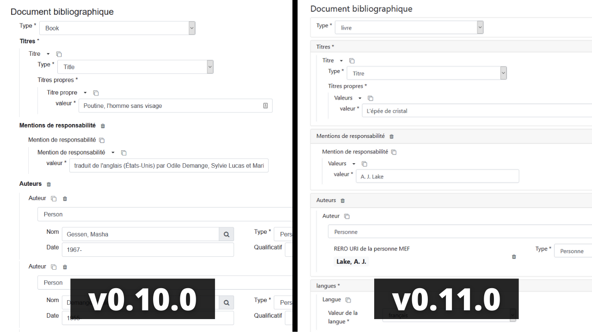

Nouveau mois écoulé, nouvelle version de  disponible sur [l'interface de test][1]. Le travail de l'équipe de développement pour améliorer le logiciel continue avec une nouvelle mise à jour qui devrait intéresser les catalogueurs et catalogueuses. Les notes de version plus complètes se trouvent sur Github : [`v0.11.0`][2].

<!--more-->

## Interface pro : l'éditeur de documents aux petits soins

Comme c'est l'un des outils principaux des bibliothécaires, notamment pour le catalogage, l'éditeur de document se doit de proposer une interface claire et ergonomique. C'est d'autant plus le cas que ce module doit fréquemment afficher des données complexes selon des règles pas toujours évidentes.

Le travail en vue de peaufiner cette interface est constant et se manifeste dans cette version par une amélioration de sa lisibilité.

Cette amélioration visuelle s'accompagne de plusieurs ajustements : 
* Ajout des champs `partOf` (document hôte), `seriesStatement` (mention de collection) et `issuance` (mode de publication). Cela permet d'établir des liens propres entre les documents, une petite révolution au sein du réseau où ces liens se basaient jusqu'à présent uniquement sur des chaînes de caractères.
* Correction de l'affichage de certaines traductions, notamment dans le formulaire _Ajouter un champ_. A noter que toutes les traductions ne sont pas à jour dans cette version en raison d'un changement de plateforme de traduction en cours. Ces problèmes seront corrigés dès la prochaine version.
* Correction de bugs dans la sauvegarde de documents
* Les liens de raccourcis _Aller à_ dans le panneau de droite sont maintenant fonctionnels

## Listes d'inventaire

Autre nouvelle fonctionnalité de cette `v0.11.0`, les listes d'inventaire. Accessibles dans l'interface professionnelle par le menu _Reports & monitoring_, elles permettent d'afficher des listes d'exemplaires, de les filtrer et de les exporter directement en format `CSV`.

Dans le même temps, les exemplaires se dotent également d'un nouveau champ `second_call_number` leur permettant d'avoir une deuxième cote qui s'affiche, elle aussi, dans les listes d'inventaire.

[1]: https://ils.test.rero.ch
[2]: https://github.com/rero/rero-ils/blob/master/RELEASE-NOTES.rst#v0110